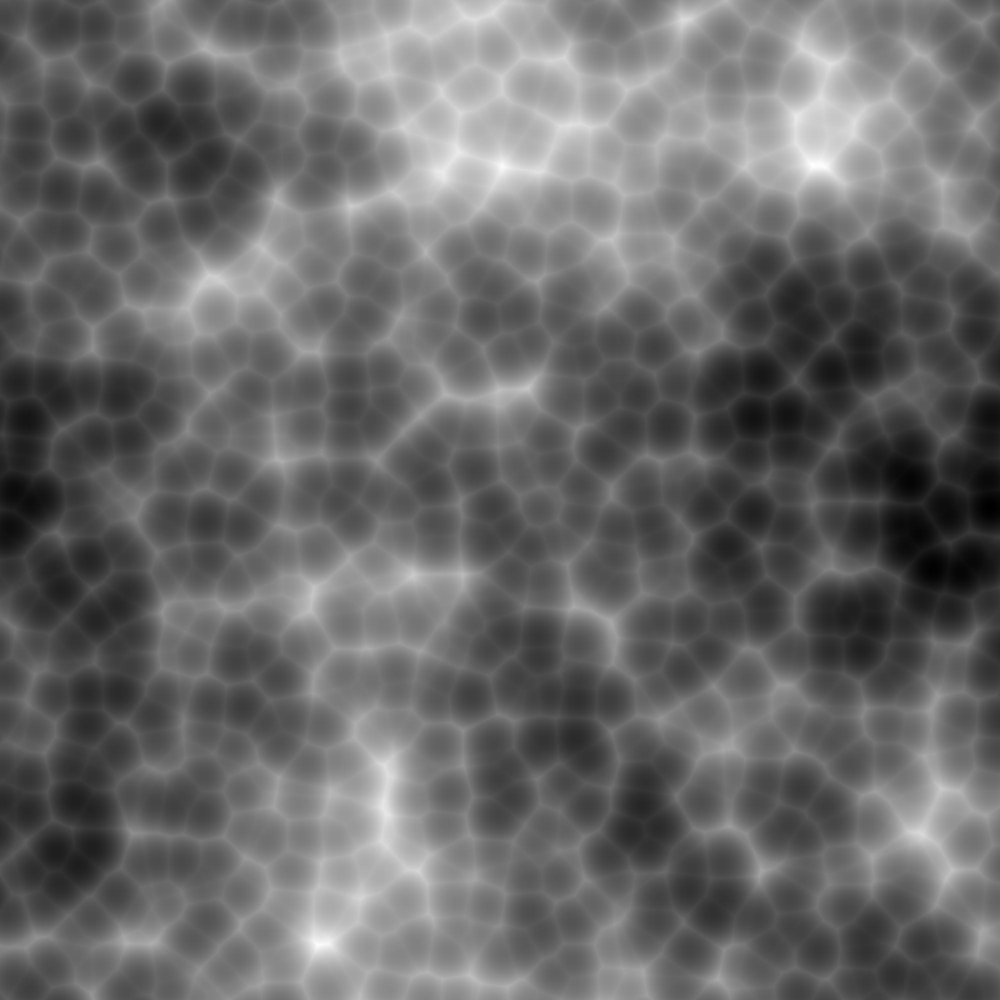
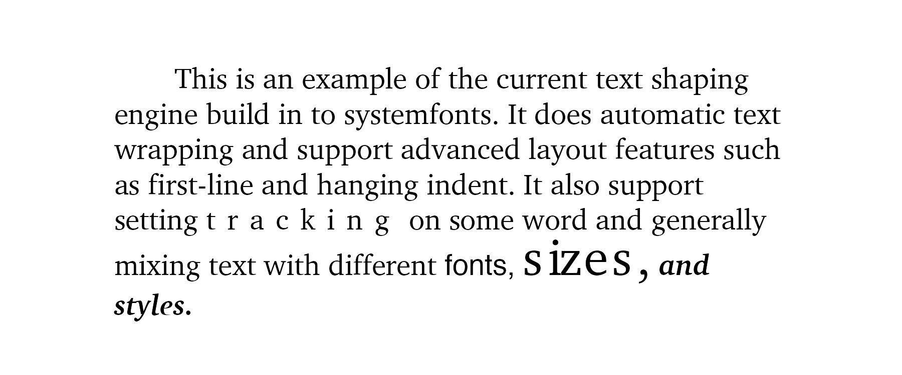

We're thrilled to announce the new releases of ragg and systemfonts. ragg is a package that provides a modern set of raster devices as alternatives to the ones you know from the grDevices package (e.g. `png()`). systemfonts is a low level package that provides font-related utilities to graphic devices, most importantly detecting and matching fonts to the correct font files across systems.

While these are not the most flashy of releases, we thought it would be a good time to discuss some of our thoughts on the future of graphics in R, especially related to fonts.

## ragg 0.2.0
ragg is our take on a modern set of raster devices for R, based based on the AGG 2D graphics library which provides both [high quality](https://ragg.r-lib.org/articles/ragg_quality.html) and [high performance](https://ragg.r-lib.org/articles/ragg_performance.html) output (you can read more about it in [the 0.1.0 release post](https://www.tidyverse.org/blog/2019/07/ragg-0-1-0/)). It also provides high quality font support and automatically finds fonts installed on your computer. 

This release has resolved many rendering bugs and include one major new features: the addition of a jpeg device (`agg_jpeg()`) that produces jpegs. jpeg is a lossy image format (i.e. it decreases the image quality to reduce file size) as opposed to png which uses a lossless compression scheme. That means that jpeg is usually not the best choice for most R graphics, but it does excel in compressing image data, so for this type of plot it can offer a very high compression with almost no noticeable degradation in quality:


```r
library(ragg)
#> Warning: package 'ragg' was built under R version 3.6.2
library(fs)
#> Warning: package 'fs' was built under R version 3.6.2

# Creating some image data
library(ambient)
library(dplyr)
noise <- long_grid(
    x = seq(0, 1, length.out = 2000), 
    y = seq(0, 1, length.out = 2000)
  ) %>% mutate(
    z = fracture(
      noise = gen_worley, 
      fractal = billow, 
      octaves = 4, 
      gain = ~ .x * 0.75,
      frequency = ~ .x * 3,
      x = x, 
      y = y,
      value = "distance",
      seed = 12
    )
  )

# plot using png
pngfile <- path(knitr::fig_path(),  "png_image.png")
agg_png(pngfile, 2000, 2000)
plot(noise, z)
invisible(dev.off())
knitr::include_graphics(pngfile)
```


```r
# plot using jpeg
jpegfile <- path(knitr::fig_path(),  "jpeg_image.jpeg")
agg_jpeg(jpegfile, 2000, 2000)
plot(noise, z)
invisible(dev.off())

knitr::include_graphics(jpegfile)
```



As you can hopefully agree on, there is no noticeable quality difference between the two. What about file size?


```r
file_size(pngfile)
#> 944K
file_size(jpegfile)
#> 387K
```

We observe more than a 50% file size reduction. Again, this is only worth it when saving image-type plots with high-frequency variations. `agg_png()` should be your go-to device for most data visualizations.

## systemfonts 0.2.0
systemfonts is a package that spun out of the development of ragg. Its main claim-to-fame is its ability to find the correct font file for a specific font and style. This release has improved a lot of the underlying implementation and added a bunch of new features that may interest you.

### Why is text so hard?
Before we delve into the features of systemfonts it may be good to understand why fonts don't just work. At its core text and fonts are just very messy, with differences between operating systems and font file formats to name some of the challenges. (For a humorous overview consult the [*Text Rendering Hates You*](https://gankra.github.io/blah/text-hates-you/)). 

There are simply so many issues related to how finding the font files, reading the content, figuring out the correct glyphs for a character string, and determining the correct position of each glyph, that most applications use high-level solutions such as those provided by the operating system or e.g. [Pango](https://www.pango.org). This is not really an option for graphic devices as text is used in many other ways than the standard "text box" use that the high-level solutions are tailored to. All-in-all this makes it rather difficult to do fully correct text rendering on graphics device.

### New features
The core functionality of systemfonts (finding font files) has been expanded with this release. It now makes heavy use of caching to speed up the font queries that may happen many hundreds of times for a single plot. This gives a nice speed boost, but comes at a cost: if a font is installed while your R session is running, you'll need to explicitly run `systemfonts::reset_font_cache()` in order to flush the cache. 

systemfonts has also gained the ability to register fonts that are not installed in the usual place so that e.g. packages can provide a new set of fonts. This is done with the `register_font()` function. The font registration can also be used to get access to fonts that are not easily targeted with the limited information you can pass through the graphic engine in R (family, bold-or-not, italic-or-not), or if you want to overwrite the system-specific mappings of `'sans'`, `'serif'`, and `'mono'`.

Apart from font file matching, systemfonts now also provides the basic infrastructure for text shaping, that is, figuring out the placement of glyphs on a page, taking size, kerning, etc. into account. It further provides efficient functions for calculating string widths and glyph dimensions, something needed if you choose to implement a graphic device. 

The text shaping, font information, and glyph metrics are available from R, although the intended use is primarily from C:


```r
library(systemfonts)
#> Warning: package 'systemfonts' was built under R version 3.6.2

font_info(family = "spectral")
#> # A tibble: 1 x 22
#>   path  index family style italic bold  monospace kerning color scalable
#>   <chr> <int> <chr>  <chr> <lgl>  <lgl> <lgl>     <lgl>   <lgl> <lgl>   
#> 1 /Sys…     0 Helve… Regu… FALSE  FALSE FALSE     FALSE   FALSE TRUE    
#> # … with 12 more variables: vertical <lgl>, n_glyphs <int>, n_sizes <int>,
#> #   n_charmaps <int>, bbox <list>, max_ascend <dbl>, max_descend <dbl>,
#> #   max_advance_width <dbl>, max_advance_height <dbl>, lineheight <dbl>,
#> #   underline_pos <dbl>, underline_size <dbl>
```


```r
glyph_info("glyphs", family = "spectral", size = 14)
#> # A tibble: 6 x 9
#>   glyph index width height x_bearing y_bearing x_advance y_advance bbox     
#>   <chr> <int> <dbl>  <dbl>     <dbl>     <dbl>     <dbl>     <dbl> <list>   
#> 1 g        74     7     10         0         7         8         0 <dbl [4]>
#> 2 l        79     3     10         0        10         3         0 <dbl [4]>
#> 3 y        92     7     10         0         7         7         0 <dbl [4]>
#> 4 p        83     8     10         0         7         8         0 <dbl [4]>
#> 5 h        75     7     10         0        10         8         0 <dbl [4]>
#> 6 s        86     7      7         0         7         7         0 <dbl [4]>
```


```r
text <- c(
  "This is an example of the current text shaping engine build in to systemfonts. It does automatic text wrapping and support advanced layout features such as first-line and hanging indent. It also support setting ",
  "tracking",
  " on some word and generally mixing text with different ",
  "fonts, ",
  "sizes,", 
  " and styles."
) 
family <- c(
  'charter', 
  'charter', 
  'charter', 
  'exo 2', 
  'charter', 
  'charter'
)
italic <-  c(rep(FALSE, 5), TRUE)
bold <- c(rep(FALSE, 5), TRUE)
style <- c(rep("plain", 5), "bold.italic")
size <- c(rep(14, 4), 24, 14)
shape <- shape_string(
  text, 
  id = 1, 
  family = family,
  italic = italic,
  bold = bold,
  size = size,
  tracking = c(0, 400, rep(0, 4)),
  width = 4.5,
  indent = 0.2,
  hjust = 0.5,
  vjust = 0.5,
  res = 300
)

shape
#> $shape
#> # A tibble: 299 x 7
#>    glyph index metric_id string_id x_offset y_offset x_midpoint
#>    <chr> <int>     <int>     <int>    <dbl>    <dbl>      <dbl>
#>  1 "T"      55         1         1   -133.      47.7       4.2 
#>  2 "h"      75         1         1   -125.      47.7       3.96
#>  3 "i"      76         1         1   -117.      47.7       1.92
#>  4 "s"      86         1         1   -113.      47.7       2.76
#>  5 " "       3         1         1   -108.      47.7       1.92
#>  6 "i"      76         1         1   -104.      47.7       1.92
#>  7 "s"      86         1         1    -99.8     47.7       2.76
#>  8 " "       3         1         1    -94.3     47.7       1.92
#>  9 "a"      68         1         1    -90.5     47.7       3.48
#> 10 "n"      81         1         1    -83.5     47.7       3.96
#> # … with 289 more rows
#> 
#> $metrics
#> # A tibble: 1 x 11
#>   string width height left_bearing right_bearing top_bearing bottom_bearing
#>   <chr>  <dbl>  <dbl>        <dbl>         <dbl>       <dbl>          <dbl>
#> 1 This …  1350   582.           -1            15        13.8           1.02
#> # … with 4 more variables: left_border <dbl>, top_border <dbl>, pen_x <dbl>,
#> #   pen_y <dbl>
```


```r
library(grid)

pngfile <- path(knitr::fig_path(),  "png_image.png")
agg_png(pngfile, 6, 2.5, unit = 'in', res = 300)
#> Warning in agg_png(pngfile, 6, 2.5, unit = "in", res = 300): partial argument
#> match of 'unit' to 'units'
grid.text(
  shape$shape$glyph, 
  x = unit(0.5, "npc") + unit(shape$shape$x_offset, "pt"), 
  y = unit(0.5, "npc") + unit(shape$shape$y_offset, "pt"),
  hjust = 0,
  vjust = 0,
  gp = gpar(
    fontfamily = family[shape$shape$string_id],
    fontface = style[shape$shape$string_id],
    fontsize = size[shape$shape$string_id]
  )
)
invisible(dev.off())
knitr::include_graphics(pngfile)
```



When you see this you may immediately think of the work Claus Wilke has done with [gridtext](https://wilkelab.org/gridtext/). We are both committed to improving the rich text support in R, and are attacking the problem from different directions. Claus has worked on doing per-word shaping, whereas the text shaping done in systemfonts are done glyph-by-glyph. Both approaches have their merits, and we are currently at a stage where we are trying to figure out how to best solve this in R. At the time of writing there is no doubt that gridtext is more complete and stable, but doing glyph-based shaping offers possibilities that are not possible with gridtext, e.g. setting tracking and flowing text along paths. All of this is highly experimental still, and there will need to be some changes in the graphic engine to make glyph-based rendering performant.

### The font-ier
A big (for some) issue that I haven't touched upon is support for ligatures. A **ligature** is a glyph that represents multiple characters, as when "f" and "i" are substituted for the single glyph "fi". Ligatures are often used as flourishes in Western scripts but are essential for other scripts such as Arabic. Further, ligatures power emojis which have become an integral part of modern communication. 

While we don't currently have support for ligatures, there's no doubt that we need it. The exact mechanism for this is still up in the air because ligatures must be resolved at the font rendering level. Each font file may provide their own unique ligatures and the mapping from multiple characters to a single glyph can be encoded into a number of different substitution table formats in the font file. Because of this complexity it is often handled by a dedicated library such as [HarfBuzz](https://www.freedesktop.org/wiki/Software/HarfBuzz/). This could of course be wrapped by an R package but since ligatures can not be encoded with unicode (for the most part), there is no way of precomputing the substitution and pass it on to the graphic devices. Whether ligature support can retroactively be added to old graphic devices is thus still up in the air.

Text rendering in R is a delicate collaboration between graphic devices, the graphic engine, and additional support packages such as systemfonts and gridtext, but thankfully the focus and will is there in all parts to push this forward.
