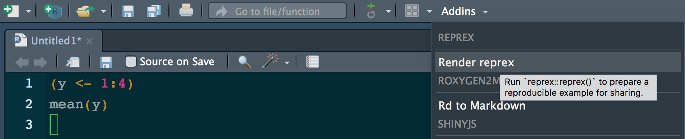
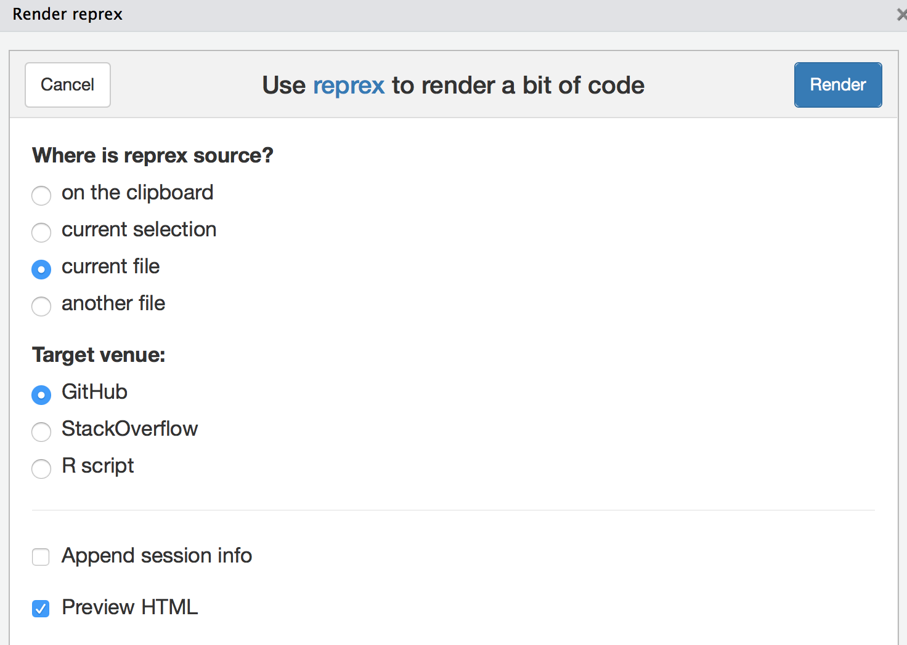

> In space, no one can hear you scream.
>
> -- <cite>Alien (1979)</cite>
  
Luckily the tidyverse is a friendlier place. Ease of adoption and ease of use are fundamental design principles for the packages in the tidyverse. If you are banging your head in frustration, here's how you can help us help you.

## Make a reprex {#reprex}

If you need help getting unstuck, the first step is to create a __reprex__, or reproducible example. The goal of a reprex is to package your problematic code in such a way that other people can run it and feel your pain. Then, hopefully, they can provide a solution and put you out of your misery.

There are two parts to creating a reprex:

* First, you need to make your code reproducible. This means that you need
  to capture everything, i.e., include any `library()` calls and create all necessary objects. The easiest way to make sure you've done this is to use the [reprex package](/help#reprex-pkg).
  
* Second, you need to make it minimal. Strip away everything that is not directly related to your problem. This usually involves creating a much smaller and simpler R object than the one you're facing in real life or even using built-in data.
  
That sounds like a lot of work!  And it can be, but it has a great payoff:

* 80% of the time creating an excellent reprex reveals the source of your problem. It's amazing how often the process of writing up a self-contained and minimal example allows you to answer your own question.

* The other 20% of time you will have captured the essence of your problem in
  a way that is easy for others to play with. This substantially improves
  your chances of getting help!

## The reprex package {#reprex-pkg}

When creating a reprex by hand, it's easy to accidentally miss something that means your code can't be run on someone else's computer. Avoid this problem by using the [reprex package](http://reprex.tidyverse.org). It's installed as part of the tidyverse *(will be true soon)* or you can install it by itself. Go ahead and load it.

```R
## pick one:
##   install.packages("tidyverse") <-- will work soon
##   install.packages("reprex")    <-- works today

library(reprex)
```

Write a bit of code and copy it to the clipboard:

```R
(y <- 1:4)
mean(y)
```

Enter `reprex()` in the R Console. In RStudio, you'll see a preview of your rendered reprex.

```R
(y <- 1:4)
#> [1] 1 2 3 4
mean(y)
#> [1] 2.5
```

It is now ready and waiting on your clipboard, so you can paste it into, say, a GitHub issue. In RStudio, you can access reprex from the [addins menu](https://rstudio.github.io/rstudioaddins/), which makes it even easier to point out your code and select the output format.

</img>
</img>

In either case, you can eventually [explore other features](http://reprex.tidyverse.org), such as formatting output for Stack Overflow or as a commented R script. reprex even uploads figures so you can easily ask questions about ggplot2.

If your code is not self-contained, running `reprex()` results in an error. It may feel like tough love, but this way you can get your story straight in private. The reprex format also strongly encourages you to find the minimal dataset necessary to show your problem. Creating an effective reprex is a learned skill and the immediate feedback from reprex makes this very concrete.

## Where to ask


<!-- Thanks to Mark Hansen for the image! https://twitter.com/cocteau/status/893811714420088832 -->

Now that you've made a reprex that you can easily inflict on others, you need to share it in an appropriate forum. Here are some options:

* [__community.rstudio.com__](http://community.rstudio.com): This is a warm
  and welcoming place to ask any questions you might have about the
  tidyverse (and you can also ask questions about shiny and RStudio there
  too!)
  
* [__Stack Overflow__](https://stackoverflow.com). You're probably already familiar
  with Stack Overflow from googling: it's a frequent source of answers to
  coding related questions. Asking a question on Stack Overflow can be 
  intimidating, but if you've taken the time to create a reprex, you're much
  more likely to get a useful answer. Make sure to [tag your question](https://stackoverflow.com/help/tagging) with R
  and tidyverse so that the right people are more likely to see it.
  
* [__Twitter__][twitter-rstats]. It's hard to share your reprex only on twitter, because 140 characters are rarely enough and screenshots don't help others play with your code. But twitter is a great place to share a link to your reprex that's hosted elsewhere. The [#rstats twitter][twitter-rstats] community is extremely friendly and active, and is a great crowd to be a part of. Make sure you tag your tweet with #rstats and #tidyverse.

* If you think you've found a __bug__, please follow the instructions on 
  [contributing to the tidyverse](/contribute#issues).

[ggplot2-ml]: https://groups.google.com/forum/#!forum/ggplot2
[manipulatr-ml]: https://groups.google.com/forum/#!forum/manipulatr
[twitter-rstats]: https://twitter.com/search?q=%23rstats&src=typd
